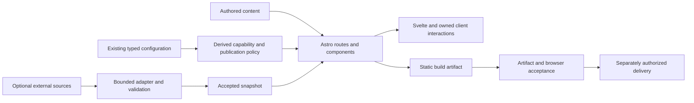

# Zhenkun-blog-site Architecture and Contracts

This document defines contracts for incremental reference alignment on Astro, Svelte, Tailwind, and the retained Firefly framework. Existing source boundaries and future proposals are distinguished below. Contracts alone do not establish acceptance or production delivery; dated evidence identifies the exact tested source and environment.

Task status and the current breakpoint belong only to [ROADMAP](ROADMAP.md). Architectural decisions belong to [DECISIONS](DECISIONS.md), including the proposed ADR-XB-006. The current comparison evidence and feature recommendations belong to the [reference-site assessment](../references/comparison-2026-10-01/report.md). [PROCESS](PROCESS.md) governs implementation, evidence, and rollback.

The owner authorized local refactor work on 2026-10-01. [REFACTOR_PLAN](REFACTOR_PLAN.md) defines concrete packet scope/dependencies and acceptance without duplicating live status. ADR-XB-008 accepts the first shared article/Wiki contract and independent publication preflight; remaining optional capabilities still require their own selection and acceptance. Implementation in a working tree is not production delivery.

## Direction

Keep the static personal blog as the product. Reuse existing capabilities before introducing replacements. Firefly remains the implementation baseline; the two reference sites provide evidence about reader experience and optional features. Their presence on a reference site does not authorize enabling the equivalent feature here.

Alignment does not mean importing the complete Aemeath customization, copying another author's identity or content, adding a backend, or installing new dependencies. Existing page templates and disabled feature configuration remain available for later owner-provided content. Framework attribution and licensing remain intact.

The immediate engineering priority is to make publication, navigation, deployment paths, interaction, and optional-service behavior agree. Visual changes follow these contracts and remain independently reviewable.

## Existing Foundation

| Concern | Existing implementation | Target responsibility |
|---|---|---|
| Configuration | `src/config`, corresponding `src/types` | Owner settings and type definitions; no secrets or task status |
| Content | `src/content`, `src/content.config.ts`, `content-utils.ts` | Authored source, schema, and publication policy |
| Routes | `src/pages`, `astro.config.mjs` | Static route generation, page guards, protocol endpoints, and indexing |
| Rendering | `src/layouts`, `src/components`, `src/styles` | Semantic HTML, responsive layout, and stable fallback content |
| Interaction | Svelte islands and existing client utilities | UI state, focus, requests, and explicit lifecycle ownership |
| External sources | Existing adapters in `src/utils`, build scripts | Bounded retrieval and validated normalized data |
| Delivery | `scripts`, `.github/workflows` | Build, artifact validation, and separately authorized publication |
| Project memory | `docs`, `references`, Git history | Decisions, current state, dated evidence, and recoverable increments |

No new top-level directory is proposed. New helpers should stay in the existing concern directories and follow repository naming conventions. New project scripts use the `zhenkun-` prefix. Avoid a generic plugin engine, dependency-injection container, global event bus, or a second application framework.

## Capability and Route Contract

### Small metadata registry

A proposed `src/config/pageRegistryConfig.ts` would describe capabilities using stable IDs, logical route paths, descendant routes, existing page keys, indexing policy, and required configuration. It is metadata, not a new router or another set of feature switches.

The registry must derive settings from the existing configuration after environment overrides. It must not persist duplicate booleans such as `friendsEnabled`, `activeStatus`, or a second page toggle map. A small evaluator can accept the resolved configuration as input; metadata should not import navigation or UI modules, avoiding configuration import cycles.

| Concept | Meaning |
|---|---|
| Configured | Required settings are valid for the selected mode; a valid empty content collection is distinguishable from a missing account or endpoint |
| Enabled | The existing owner-controlled feature switch requests this capability |
| Available | The capability can currently render meaningful approved content or an intentional empty state; external failures are represented separately |
| Indexable | A public route is eligible for sitemap/search discovery under publication and capability policy |
| Exposed | Content or assets are actually emitted or reachable, including associated API and media paths |

Runtime availability must not be stored as another configuration flag. An enabled but unconfigured integration needs an explicit development/build diagnostic and a defined production fallback, rather than a silent successful fetch or empty account request. Structural readiness must not automatically suppress legitimate empty article, tag, or archive states; those need a deliberate presentation policy.

Navigation, page guards, static path generation, sitemap filtering, and associated content endpoints should consume the same derived capability policy. Descendant routes inherit their parent capability and add their own requirements. For example, dynamic comment embedding also requires the dynamic page, its comment preference, and a configured comment service.

### Existing boundaries and bounded endpoint repair

Navigation derives visibility from resolved `siteConfig.pages` in `nav-menu-utils.ts`. Optional Astro routes use the same existing switch and `getNotFoundPath(BASE_URL)`; `deployment-contract.ts` filters sitemap descendants after removing the configured base, maps `myanimelist` to `mal`, and requires the dynamic parent before its comment child. These P2 boundaries replace the historical root-path/parent-switch defects; they are not a new registry implementation.

The P4 endpoint candidate checks `siteConfig.pages.dynamic` before creating the Markdown processor or reading `getCollection("dynamic")`. Disabled responses remain valid JSON `[]`; enabled Markdown/image metadata, ordering, schema and intentional empty collections retain their existing behavior. No endpoint, second switch map, account configuration or dependency is introduced. Exact source and in-memory execution evidence are in the [P4 measurement report](../references/p4-capabilities-2026-10-02/report.md); acceptance belongs to ROADMAP.

Gallery static paths still enumerate configured albums even when the page is off. Their render guard emits redirect placeholders, while `public/gallery` files remain copied and directly reachable. This is a visibility contract, not route or asset removal.

| Capability key | Related routes/data | Visibility and indexing contract | Setup/availability boundary |
|---|---|---|---|
| `friends` | `/friends/` | Shared page switch hides menu and sitemap entry; render guard redirects | Authored public friend records; no invented author/account data |
| `guestbook` | `/guestbook/` | Same page switch precedes comment rendering | Selected comment provider must be configured and separately exercised |
| `dynamic` | `/dynamic/`, `/dynamic/comments/`, `/api/dynamic.json`, sidebar | Parent gates both views, navigation/indexing and local JSON; child also requires comment preference/provider | Local empty content is valid; Memos is a separate optional source |
| `gallery` | `/gallery/`, configured album routes and public media | Parent gates rendered views/indexing; retained media is public | Album/password UI does not protect source or public files |
| `booknav` | `/booknav/` | Parent gates navigation, render and sitemap | Owner-selected public bookmarks and intentional empty state |
| `sponsor` | `/sponsor/` | Parent gates navigation, render and sitemap | Public payment/contact data requires explicit owner selection |
| `bilibili`, `bangumi`, `vndb`, `mal` | Corresponding collection route; `mal` uses `/myanimelist/` | Page guard precedes provider-fetch calls; disabled placeholders contain no integration scripts | Required account/mode fields and failure/empty states are provider-specific; enabling a switch is not service acceptance |

The [dated feature matrix](../references/p4-capabilities-2026-10-02/feature-matrix.md) separates resolved configuration, source guards, measured output, and unexercised enabled/unconfigured states. It is measurement evidence, not a second task checklist. The ten page flags and ancillary comment, music, analytics, decoration, display-settings and diagram settings retain their own existing configuration owners.

Turning an optional page off is a product visibility decision. It does not provide authorization, private storage, or removal of already published files. The policy must explicitly define the behavior of each related route and endpoint. Static redirect placeholders, absent generated routes, and true host-level HTTP 404 responses are different outcomes and must be documented and tested as such.

### Acceptance

Exercise disabled, enabled/configured, and enabled/unconfigured states at both `/` and `/Zhenkun-blog-site/`. Check navigation, direct requests, descendants, static path output, sitemap entries, and associated APIs. Disabled external integrations must not issue requests. Redirects must target the actual emitted 404 artifact for the deployment host; do not assume that `/404/` exists because a custom 404 page is defined.

## Path and Protocol Contract

Keep logical application paths, emitted asset URLs, external URLs, and protocol payloads separate.

| Input domain | Example | Required behavior |
|---|---|---|
| Logical route | `/about/` | Apply the configured deployment base once |
| Logical public asset | `/gallery/album/cover.avif` | Resolve under the deployment base once |
| Astro-generated asset URL | `/Zhenkun-blog-site/_astro/image.hash.webp` | Preserve its emitted path; do not prefix it again |
| Source-managed image reference | `assets/images/zhenkun/avatar.avif` | Resolve through Astro image metadata before producing public URLs |
| Absolute external URL | `https://example.com/resource` | Preserve the destination under an explicit external-link policy |
| Non-HTTP destination | `mailto:...`, anchors, `data:`, `blob:` | Handle only in the domain that permits it; do not treat it as an application route |
| Absolute canonical or social URL | Deployed origin plus a resolved public path | Compose from a validated site origin and resolved path |

Retain the existing utilities while introducing explicit call-site contracts. Do not rely on one increasingly permissive helper to infer every kind of input. Keep query strings, fragments, encoded slugs, and slash conventions intact.

`deployment-contract.ts` separates logical-route prefixing from public/already-emitted asset normalization. `schema-image.ts`, generated OG URLs in `Layout.astro`, filtered-page canonicals, sitemap and robots consume those P2 boundaries. A route matching its base name remains a valid repeated segment; it must not be normalized as an already-prefixed asset. Changes to additional callers require focused collision-base and emitted-byte evidence.

RSS dates must use the feed protocol's date representation; display dates may remain localized. Protocol endpoints must use valid XML/JSON/text, appropriate content types, deployment-aware public URLs, and the same publication policy as page rendering.

### Acceptance

Validate final HTML and protocol output for links, media sources, OG/Twitter images, canonical links, structured data, RSS, sitemap, and robots references. Verify URL resolution under both deployment bases, including already-prefixed assets and external/non-HTTP destinations. The deployed image must return usable image bytes; a syntactically plausible URL is insufficient. A valid empty feed must remain distinguishable from malformed output.

## Content and Publication Contract

Accepted local Markdown/MDX and existing collection schemas remain the source of truth for static publication. An external manuscript is separate from the accepted publishing derivative. `src/content.config.ts` owns validation; content helpers own selection and ordering; rendering components consume validated content rather than independently deciding publication.

The shared article contract and publication preflight own production eligibility, stable IDs and source validation across article routes, list metadata, taxonomy counts, RSS, OG and Wiki inputs. Development may show drafts for review, but production must omit them consistently. Draft publication requires owner review. A development screenshot containing a draft is not production acceptance.

Content publication, feature activation, visual changes, external-service setup, and deployment remain separate decisions. Do not publish drafts or invent posts, friend records, sponsor records, dates, accounts, or statistics to make a reference comparison look complete.

### Manuscript and editorial boundary

Proposed ADR-XB-007 recommends the existing Obsidian vault as the manuscript source, an optional Blog Space as an editorial workspace, and Git as the accepted publishing input. Evidence and alternatives are in the [authoring assessment](../references/authoring-2026-10-01/report.md). This is not an implemented synchronization service or permission to create a Space/upload notes.

Begin with one explicitly selected, manually exported article. Space revisions are suggestions until adopted into the canonical manuscript. A repository publishing copy must not be silently overwritten after independent edits. Choose one manuscript master per article; if Space later becomes the main editor, local content becomes an accepted snapshot instead of a second master.

Selection owns public eligibility; conversion owns syntax and path mapping; schema owns validated content; publication policy owns emitted readers' content; delivery owns separately authorized remote actions. These concerns must not be collapsed into a file watcher. `draft:true`, a password field, ignored staging, or absent navigation is not private storage. Keep private manuscripts and provenance outside the public repository. A Wiki reference does not authorize exporting its target or attachment.

Wiki rendering must consume the same production-eligible target set and stable IDs as article routes. Missing, draft/private, or ambiguous destinations produce explicit diagnostics before metadata cards can expose titles, descriptions, or media. Local Wiki URLs and public covers must use the route/asset deployment contracts. Obsidian file paths, website slugs, headings, embeds, and native Space references have distinct conversion rules; unsupported constructs must remain actionable gaps.

An optional future exporter belongs under `scripts/zhenkun-*`, reads an explicit selection, preserves source material, compares source/destination hashes, and produces a reviewable diff without pruning or automatic overwrite. A Space adapter reads only selected authorized Pages and converts approved text/files into local candidates; it is not an authenticated reference pasted into public output or a required cloud dependency of builds. No new backend, dependency, scheduler, or two-way sync is required for the initial pilot.

### Optional project model

The inspected local repository has no dedicated project collection or project index/detail routes. The comparison captured a project collection page on CuteLeaf; pinned upstream source inspection at Firefly commit `6d82554b` also confirms `projectsCollection` in `src/content.config.ts`, a `ProjectCard`, project index/detail routes, and supporting utilities. This is a source-confirmed reuse candidate, not a feature already present locally or validated here.

If a project section is selected later, evaluate a focused adaptation of those schema, rendering, and utility pieces within the existing directories. Do not merge upstream or transplant a complete theme to obtain it. Its content fields, route/publication policy, empty state, optional assets, and acceptance must be specified before implementation. Until that decision is accepted, genuine project evidence can accompany an ordinary project article; an intake folder does not create or activate a projects section.

### Acceptance

Use authored fixtures for draft/published selection, empty production content, series ordering, taxonomy consistency, and password-protected post metadata. Verify agreement across article HTML, RSS, OG routes, metadata APIs, and Pagefind output. An empty homepage requires an intentional reader-facing state with useful approved navigation; it must not require forced publication.

## Bilingual feasibility and proposed contracts

The existing typed UI catalog is reusable: six catalogs each have 419 keys, with complete nonempty English/Simplified Chinese key coverage and matching named placeholders. This is a build-wide language facility, not translation pairing or localized routing. The source inventory and installed-version synthetic measurements are in the [P8 report](../references/p8-feasibility-2026-10-02/report.md). [ADR-XB-014](DECISIONS.md#adr-xb-014复用-catalog以显式页面语言与真实译文配对渐进迁移) compares a shared one-build route design with separate language builds; these remain proposed implementation contracts. Task/acceptance state stays in ROADMAP.

Keep deployment base, locale prefix, logical route/ID and published translation availability separate. Chinese URLs and stable IDs remain valid. Route helpers construct URLs but do not establish that a translated page exists. Proposed pair discovery applies the existing publication predicate before locale selection; missing/draft/private translations cannot enter alternate links, API/feed/search/sitemap. English owner copy needs editorial review. The public brand and author both remain Zhenkun.

Per-page locale must be explicit for shared rendering/client instances, rather than changing global configuration during prerender. Installed Astro absolute locale helpers join the site's existing path with the already-based route, reproducing path retention/duplication with the current project URL; an origin/base adapter must preserve the P2 logical-route collision contract. Locale-prefixed capability filtering and search/archive canonicals require extension before emitting such pages. No existing switch/service is activated by localization.

Installed Swup Head already updates HTML lang/dir. The unresolved ownership is cached Pagefind/UI state: Pagefind 1.5.2 detects HTML language at initialization and overrides a public createInstance language option. Initial cross-language full-document navigation is recommended, pending G6, while same-language Swup retains its P3 lifecycle. This trades a document reload for a fresh locale context; theme/music behavior and later soft locale transitions require actual browser verification. Default language, preference memory, missing-translation presentation and comment identity remain G6 decisions.

The synthetic five-page builds prove both bases, self/reciprocal metadata structure, absent translated-file behavior and real multilingual Pagefind initialization in fresh Node Worker contexts with a minimal document-language seam. They are not full-theme, browser, Linux, hosted or production acceptance. Future implementation retains the formal pipeline and article publication gates.

## External Source and Snapshot Contract

External content is optional. Prefer local Markdown for initial dynamics and authored configuration for friend links. A future friend-feed reader or collection integration should use an explicit adapter boundary instead of placing fetching/parsing logic into page layout.

The preferred collection path is `optional collection -> validated candidate snapshot -> accepted snapshot -> static rendering`. Candidate data is not accepted content. A browser can retain progressive enhancement for selected integrations, but it must not become the only path to core authored content.

### Retrieval and validation

Each adapter specifies allowed endpoint/protocol behavior, redirect policy, maximum response/download size, timeout, pagination/item limits, concurrency, and retry bounds appropriate to the selected provider. Choose and record these values in that feature's implementation proposal; this document does not invent measured limits. Enforce byte limits while reading, not only through an optional `Content-Length` header. Reject unsupported or unexpected data instead of silently accepting it.

For owner-entered third-party feed URLs, validate destinations and redirects before retrieval, including protection against unintended access to local/private network resources from build infrastructure. Credentials remain in the permitted build environment and must never enter shared client configuration, snapshots, URLs, or logs.

Normalize timestamps, stable entry IDs, canonical source URLs, safe media references, and text/HTML into a typed schema. Validate HTML and URL handling before external Markdown or feed HTML reaches an `innerHTML` sink. Existing Memos rendering needs this assessment before activation. Source attribution remains attached to each accepted entry; use summaries and source links unless full-content/media reuse is authorized.

### Coverage and freshness

Snapshots carry source identity, source URL, collection time, last successful collection time, schema version, and explicit coverage. Distinguish complete, partial, failed, unavailable, and stale states from a successful empty result. Preserve the previous accepted snapshot after retrieval failure; never replace it with an empty array and call that success. Render a readable stale/error indication when relevant.

Optional external-source failure should not erase local authored content or silently fail an unrelated build. A feature proposal must explicitly choose whether failure blocks its own activation or allows a previously accepted snapshot. Keep incoming diagnostics and rejected candidate data outside public output; use `tmp/` for staging and only explicitly accepted records under the existing content structure.

### Acceptance

Test valid empty data, malformed schema, timeout, HTTP errors, oversized/redirected responses, duplicate IDs, pagination truncation, stale data, and partial provider coverage. Confirm failed intake does not overwrite accepted data, expose secrets, or masquerade as zero items. Verify attribution, deterministic static rendering, and absence of external requests when a capability is disabled. New automatic or recurring collection requires its own authorization and operating plan.

## Rendering, Interaction, and Lifecycle Contract

Astro owns semantic HTML and stable static content. Svelte islands own bounded interactive state. Browser preferences may override presentation defaults, but they do not change content-publication authority or feature setup requirements.

Classify each client feature as persistent shell state or page-local state. Keep the existing music singleton where persistence is intentional. Initialize the shell once; mount page-local behaviors after replacement; dispose listeners, observers, timers, animations, and outstanding requests before their owning DOM is replaced. Refresh existing persistent views without duplicating their managers.

Use the current Swup orchestration as the main lifecycle path. Migrate components individually to explicit setup/cleanup contracts, following existing `onMount` cleanup and observer-disconnect examples. Multiple compatibility event names must be justified by observed behavior, not accumulated as fallback guesses. The typewriter's repeated event/hook subscriptions and the inactive background player's Astro-only cleanup are candidates for measured review, not proven runtime-leak findings.

Search uses one effective query/request session per active interaction, with stale-result invalidation; a hidden empty input must not cancel the active query. The modal drawer contract requires focus entry/containment, Escape, focus restoration and background-state restoration on every close/replacement path. P3 owns these source boundaries and lifecycle guards; further interaction changes need fresh browser evidence. Nonmodal search suggestions retain their own semantics rather than inheriting a blanket modal trap.

Reduced-motion preferences, explicit labels, focus visibility, heading ownership, and responsive readability belong to component contracts. Existing framework behavior should remain until a focused change has before/after evidence.

### Acceptance

Use actual production Pagefind output for first-query, slow-loading, rapid-query, empty-query, cancellation, and navigation tests. Development search uses mock results and cannot establish production search acceptance. Verify keyboard focus, Tab/Shift+Tab, Escape, repeated opening, route replacement, and history navigation. Repeat navigation to check that handlers execute once and page-local resources stop after disposal. Check desktop/mobile layout, light/dark appearance, reduced motion, and physical-browser behavior where relevant; separate these results from static diagnostics.

## Asset and Privacy Contract

Reuse the existing owner avatar and desktop/mobile candidate wallpapers before requesting replacements. Preserve source provenance and meaningful originals; create traced derivatives rather than overwriting source material. Use owner-specific names instead of upstream example names.

| Asset stage | Location | Publication behavior |
|---|---|---|
| Unreviewed candidate intake | `tmp/asset-intake/` | Ignored staging; not a secure private store and not a deployment input |
| Approved avatar, brand, wallpaper, or shared image | `src/assets/images/zhenkun/` with purpose subdirectories | Eligible for Astro processing and public output when referenced |
| Approved article-specific image | `src/content/posts/<slug>/`, colocated with a new article; existing asset locations may remain | Eligible for Astro processing; a colocated cover can use `image: "./cover.avif"` without migrating old articles |
| Approved public album image | `public/gallery/<album-id>/` | Directly copied into public output under the existing gallery scanner contract |
| Audit/reference capture | `references/` | Evidence only; respect its separate Git/public-repository exposure |

Do not stage sensitive originals in a public repository or assume that ignored files are secure storage. Public derivatives should have appropriate attribution, captions/alt text, crop suitability, file weight, and metadata/privacy review. Album ordering follows filenames and `cover.*` precedence in the existing scanner.

The current encrypted-gallery feature encrypts HTML, not the original files in `public/gallery`. Its password prompt does not make those images private. Page switches, sitemap omission, robots rules, and unlinked URLs also do not provide privacy. Private photo storage would require a separately evaluated architecture and authorization; it is not part of this alignment plan.

### Acceptance

Validate approved image references, dimensions, crop behavior, light/dark readability, mobile rendering, alt text, and direct asset reachability. Confirm public output contains only approved public material. If files remain in `public`, do not claim they were removed merely because UI references were cleared. No file deletion or irreversible asset cleanup is authorized by this document.

## Build and Delivery Contract

Treat source diagnostics, static build output, production browser behavior, and deployed host behavior as separate evidence layers. A passed type check cannot prove first-search correctness, and a development preview cannot prove final deployment URLs.

Workflow definitions pin Node/pnpm, install from the frozen lockfile, and run the complete declared `pnpm build` chain for both bases with static/native and artifact checks. Pages calls the same-commit reusable quality workflow, then builds and validates its own upload artifact. ADR-XB-011 records the intentional repeated-build cost. These definitions replace the historical Astro-only/non-frozen mismatch; they require independent Linux/hosted execution, required-check compatibility and separately authorized deployment evidence.

Dependency advisories require provider/consumer reachability assessment and targeted compatible changes. Do not apply force-major upgrades or global overrides just to reduce a raw advisory count. New dependencies and dependency-declaration edits require the applicable authorization.

The repository's no-filesystem-deletion instruction requires an exact exception for build tools that clean generated output/cache. The existing pruning and font-subsetting scripts explicitly delete files. This architecture document grants no exception and proposes no bypass; ROADMAP records the owner's applicable scope. Report affected verification as BLOCKED whenever that scope is missing.

### Acceptance

Run fresh source diagnostics and a complete final-source build when permitted. Inspect generated public routes, approved assets, protocol files, Pagefind output, and final metadata. Verify the artifact through production preview and the deployment host under the configured base. Record the environment, source revision/working-tree scope, commands, and evidence. Do not infer push, merge, deployment, release, or draft-publication authorization from a successful local check.

## Incremental Migration Sequence

Use [REFACTOR_PLAN](REFACTOR_PLAN.md) for packet scope and dependency order, and ROADMAP for current state and authorization. Shared article/Wiki contracts precede deployment/media/feed correctness. This makes source eligibility and identity explicit before a manuscript pilot and broader output repairs; architecture text does not establish cleanup or release acceptance.

Preserve the following dependency constraints across packets:

- Finish clean public-output acceptance before claiming author-information removal or a release. Blocked production cleanup does not prevent bounded local source work.
- Establish publication, deployment, indexing and interaction correctness before activating optional modules or publishing a pilot. Keep the existing visual design and persistent music behavior during reliability repairs.
- Introduce small capability metadata from existing configuration, migrate one optional module and its descendants/indexes at a time, and remove repeated decision logic only after equivalent behavior is evidenced. Retain templates and switches.
- Adopt owner-approved public content before visual hierarchy or optional presentation work. Each visual variable retains its own acceptance. External-feed intake remains a separate bounded adapter/snapshot choice.
- Review lifecycle ownership as a feature is touched. Decoration, characters and advanced display controls follow readability, accessibility, data readiness and media provenance acceptance.

Delivery reproducibility and relevant dependency exposure are release conditions across these increments, not permission to postpone unsafe delivery until the end. Each increment has its own source scope, evidence, and rollback boundary. Revert a completed increment through Git history; do not destructively reset, rewrite published commits, or delete retained templates. A failed visual iteration should not be bundled with unrelated engineering work.

## Evidence and Memory Ownership

| Record | Exclusive responsibility |
|---|---|
| ROADMAP | Task status, current breakpoint, pending acceptance, and next authorized scope |
| DECISIONS | Architectural choice, alternatives, rationale, verification, and reconsideration conditions |
| ARCHITECTURE | Layer responsibilities, contracts, and migration dependency order |
| PROCESS | General execution, evidence, and rollback rules |
| ERROR_MEMORY | Actual errors, repairs, and prevention rules |
| Dated `references/` material | Reference observations, screenshots, experiments, and acceptance evidence |
| Git history/diff | Implemented source and recoverable changes |

Reference observations should identify capture date, URL, viewport, interaction, and whether a claim was directly observed, inferred, or unverified. Architectural recommendations must link back to evidence rather than silently upgrading an inference into an implemented capability.

Report PASS, FAIL, BLOCKED, and NOT_APPLICABLE separately. Preserve historical evidence as a snapshot; a new source edit invalidates affected acceptance, and recovery requires fresh verification. Do not maintain copied task checklists in this document or infer current source state from an old screenshot. Cross-record contradictions are resolved against the live repository and explicitly documented before affected implementation resumes.

## Approved Home/About locale contract

G6's single-build Chinese original URLs plus explicit English prefix direction and monolingual UI are approved; the earlier feasibility text describes the historical proposal. The first candidate implements explicit render locale, a four-view approved page registry, reciprocal alternates only for real Home/About pairs, locale-aware canonical/discovery filtering, native cross-language navigation and document-language runtime controls. The original article publication predicate/config and every existing switch remain in force. The typed pair/comment-ID helper is a future article seam, not real article/giscus integration. English author bio is accepted. Preference is a local entry hint with explicit URL priority. Actual bounded measurements and unmigrated build-time labels are in the review packet; task/acceptance state remains exclusively in canonical ROADMAP.
