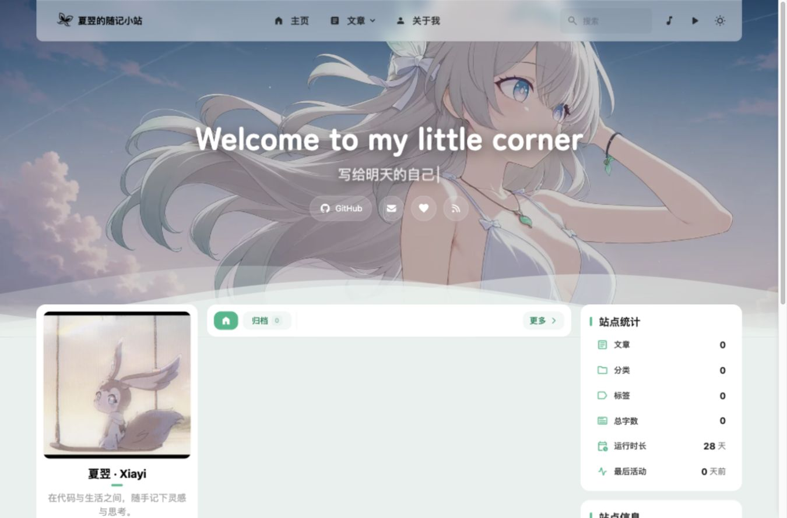
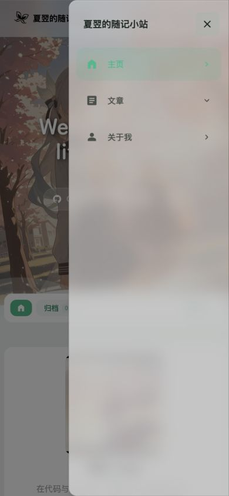
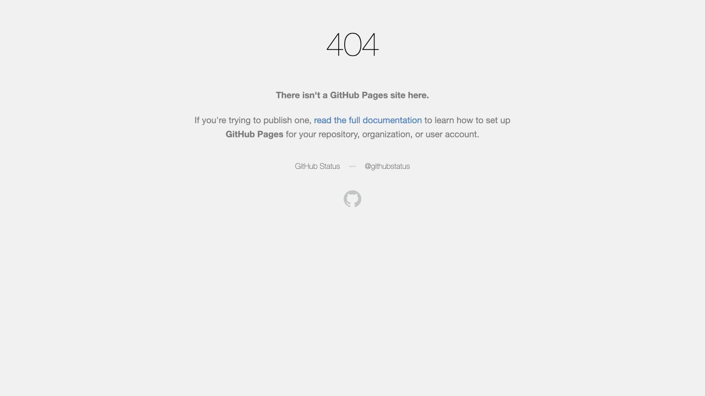

# Zhenkun-blog-site review — 2026-10-01

## Scope and conclusion

Reviewed repository revision `bc21bfd92dd7081f2cf0acbec80d446f9d02c7de` and the live site at <https://zhenkun26.github.io/Zhenkun-blog-site/>. This was a review, with evidence and status records only; no application fixes, dependency updates, commits, pushes, or deployments were performed.

The site and About page are reachable, the visual language is consistent, and the approved draft remains unpublished. The most useful next increment is correctness work on link ownership, production base paths, search initialization, and keyboard navigation. Visual expansion can wait until these are resolved.

All findings below use evidence captured in this run. Earlier project records were used for scope and authorization context, not as current validation evidence.

## Reader journey and accepted captures

1. Enter the desktop homepage: [home-desktop-stable.jpg](home-desktop-stable.jpg). The center column has no published posts or explanatory empty state; both sidebars remain populated.
2. Follow About: [about-desktop-stable.jpg](about-desktop-stable.jpg). Navigation completes and the personal introduction renders.
3. Search from a fresh About page: [first-search-desktop.jpg](first-search-desktop.jpg), then [retry-search-desktop.jpg](retry-search-desktop.jpg). The same keyword fails to show a panel initially and returns About after clearing and re-entering it.
4. Enter the mobile homepage and open its menu: [home-mobile.jpg](home-mobile.jpg), [menu-mobile.jpg](menu-mobile.jpg). The narrow layout fits the viewport. Keyboard focus can leave the open drawer.
5. Search on mobile: [search-mobile.jpg](search-mobile.jpg). A result is visible; Escape closes this panel and returns focus to its trigger.
6. Visit a disabled route from the generated sitemap: [disabled-page-final.jpg](disabled-page-final.jpg). It leaves the project path and reaches GitHub's generic “Site not found” page.

Viewport overrides requested for responsive checks were 1365×900 and 390×844; the browser's DOM client widths were 1350 and 375 respectively with its scrollbar. Fresh-tab captures used the browser's default viewport. This was browser viewport testing, not physical-device testing.

`home-desktop.jpg` and `about-desktop.jpg` capture transient loading states and are retained as diagnostic records, not accepted layout evidence. `home-initial.jpg` is an exploratory full-page capture and is not used for viewport geometry conclusions. `search-desktop.jpg` and `search-again-desktop.jpg` document the preliminary search observation; the fresh-tab capture pair above is the reproduction evidence.

## Confirmed findings

### F01 — P1: Hero contact and donation links identify the upstream author

- Location: `src/config/backgroundWallpaper.ts:103–119`.
- Evidence: The live hero GitHub link points to `CuteLeaf/Firefly`; its Sponsor link points to `blog.cuteleaf.cn/sponsor/`. The hero email also differs from the configured owner contact in `profileConfig.ts`. See the homepage captures and `http-evidence.json`.
- Impact: Readers can mistake upstream links for the blog owner's profile, contact, and donation destination. Donation misdirection is the reason for P1 priority; no payment was attempted.
- Recommendation: Align hero profile/contact links with the owner's approved configuration and remove or explicitly relabel the donation entry until its intended destination is approved. Preserve the theme attribution in the footer.

### F02 — P2: The first desktop search is cancelled during initialization

- Location: `src/components/controls/Search.svelte:176–181`; the empty-input path at lines 95–100 calls the shared cancellation function.
- Reproduction: Open a fresh About page, enter `气象`, and wait for initialization. No results panel opens. Clear the input and enter the same keyword again; About now appears.
- Evidence: `first-search.json` records `panelClosed: true`; `retry-search.json` records `panelClosed: false` and the matching result. Both states have accepted screenshots.
- Source explanation: Both desktop and mobile reactive search blocks run when `initialized` changes. The unused empty input cancels the shared debounce timer/request. This is the source-based explanation for the observed initialization race.
- Recommendation: Schedule only the active input's query during initialization; keep clearing an inactive input from cancelling an active query. Verify the first query in a fresh production page as well as subsequent queries.

### F03 — P2: The mobile modal drawer leaks keyboard focus

- Location: `src/components/layout/NavMenuPanel.astro:18`; `src/utils/floating-panel-utils.ts:31–54` manages panel visibility and scroll locking but does not move or contain focus.
- Reproduction: Open the mobile menu, press Tab from its trigger, then press Escape. Focus moves to the hero GitHub link behind the scrim and Escape leaves the drawer open.
- Evidence: `menu-keyboard.json` records `menuOpen: true`, `insideMenu: false`, and the focused upstream URL; `menu-mobile.jpg` shows the modal drawer.
- Impact: Keyboard users operate obscured background controls and lose the expected Escape exit. The drawer advertises `aria-modal="true"` while background controls remain reachable.
- Recommendation: Move focus into the drawer, contain sequential focus, make background interaction unavailable while open, and restore focus on close. Handle Escape for the active modal even if focus is displaced.

### F04 — P2: Share images and local-image structured metadata duplicate the deployment base

- Location: `src/utils/schema-image.ts:83–86`.
- Evidence: Home, About, and Archive emit `og:image` containing `/Zhenkun-blog-site/Zhenkun-blog-site/_astro/firefly-light.DZ-mS7Sc.png`. That URL returns 404; its single-base equivalent returns 200. See `http-evidence.json` and `url-status.json`.
- Cause: Astro image metadata already carries the deployment base, then `url(img.src)` prepends it again. The same helper supplies local author images in structured data.
- Impact: Link previews cannot retrieve the declared image; structured image references are also unreliable.
- Recommendation: Resolve generated image URLs exactly once, distinguishing Astro asset URLs from unprefixed public paths. Check final HTML metadata and the referenced image URLs under `DEPLOY_BASE=/Zhenkun-blog-site/`.

### F05 — P2: Sitemap filters do not match project-page paths

- Location: `astro.config.mjs:239–279`.
- Evidence: The live sitemap contains 13 closed routes: bangumi, bilibili, booknav, dynamic, dynamic/comments, friends, gallery, two gallery albums, guestbook, myanimelist, sponsor, and vndb. All relevant page toggles are false.
- Cause: The filter compares paths such as `/friends/` against full paths such as `/Zhenkun-blog-site/friends/`. Dynamic comments also need to follow the parent page toggle independently of their comment settings.
- Impact: Search engines are directed to redirect stubs and unavailable content.
- Recommendation: Normalize the deployment base before filtering, and use consistent page-toggle rules for descendants. Verify the final production sitemap rather than only root-path development output.

### F06 — P2: Closed routes redirect outside the blog

- Location: `src/pages/friends.astro:17–18`, with the same root redirect pattern in all optional page routes.
- Evidence: `/Zhenkun-blog-site/friends/` serves an HTML refresh to `/404/`; the browser then reaches `https://zhenkun26.github.io/404/` and shows GitHub's generic site-not-found page. Dynamic and Gallery responses have the same target.
- Impact: Visitors leave the blog and lose its recovery navigation. On GitHub Pages these are HTTP 200 redirect HTML files, not runtime HTTP 302 responses.
- Recommendation: Use a base-aware error destination and verify the emitted static redirect and error artifact on Pages. Merely adding a prefix should not be treated as proof that a `/404/` directory exists; the generated `404.html` behavior must also be checked.

### F07 — P2: RSS lastBuildDate is a localized display string

- Location: `src/pages/rss.xml.ts:63–66`.
- Evidence: The live feed emits `2026年9月6日 20:29:37` as `lastBuildDate`. Python's RFC email-date parser rejects it with `ValueError`.
- Contract: [RSS 2.0](https://www.rssboard.org/rss-specification) requires RFC 822 date-time syntax for RSS dates.
- Impact: Strict feed consumers cannot parse this metadata. Reader-specific subscription failure was not tested and is not claimed.
- Recommendation: Serialize the feed date with protocol syntax, such as UTC/RFC date output; retain localized dates only in HTML presentation.

### F08 — P3: Enabled background video currently fails to load

- Location: `src/config/backgroundWallpaper.ts:7` and `:63`.
- Evidence: The browser reports unavailable media/video load failure, and a HEAD request to the configured upstream media URL returns 403 in this environment.
- Impact: The navigation advertises an unreliable feature and page initialization touches an external media service.
- Recommendation: Disable the entry until an approved, reachable media source is available. The 403 may depend on network or anti-hotlink policy; this audit does not establish failure for every visitor.

## Dependency and delivery observations

- `pnpm audit --prod --registry=https://registry.npmjs.org --json` completed with exit 1 and reported 50 findings: 24 high, 19 moderate, 7 low, 0 critical. Raw evidence: [dependency-audit-npm.json](dependency-audit-npm.json). Affected modules include undici, devalue, js-yaml, sharp, svgo, brace-expansion, fast-uri, serialize-javascript, and colord.
- `--prod` follows package classifications; it does not mean every reported package runs in readers' browsers. Several paths belong to language servers, bundlers, adapters, and font/image build tooling. Reachability, untrusted-input exposure, and feasible version changes must be assessed before assigning site exploitability. No exploit testing or dependency changes were performed.
- The configured npm mirror has no bulk-advisory endpoint. The first scan is **BLOCKED**, not clean; the explicit official-registry retry above provides the actual results. The registry override did not change repository configuration.
- `.github/workflows/deploy.yml:41` uses `--no-frozen-lockfile`, while checking uses a frozen lockfile. Deployment also runs separately from the checking workflow. Consider frozen dependency resolution and deploying the artifact verified by the required checks.
- Current HEAD's existing Pages run [34033228137](https://github.com/zhenkun26/Zhenkun-blog-site/actions/runs/34033228137) and check run [34033228117](https://github.com/zhenkun26/Zhenkun-blog-site/actions/runs/34033228117) are successful. Those September runs are historical evidence, not a replacement for fresh verification.

## UX and accessibility opportunities

- The owner introduction is specific and useful, desktop/mobile visual styling is consistent, ordinary navigation finishes correctly, and subsequent desktop/mobile searches retrieve real indexed content.
- The sole post has `draft: true`. The public post URL returns 404, RSS has no items, and post metadata is `[]`; this is intentional staging, not a draft-publication bug.
- Until publication is approved, add a clear homepage empty state with an About/RSS path. The current blank center column, zero-count cards, empty taxonomy sections, and example announcement make a working site look unfinished. Reduce sidebar clutter based on reader usefulness when content is available.
- Replace or disable the example announcement. Personal wallpaper/favicon work remains a separate, previously pending visual choice; the parked logo direction is not reopened by this review.
- Search inputs have placeholders but no explicit associated label/aria-label in the inspected DOM, and focus outlines are suppressed. About contains two H1 elements. Treat these as follow-up accessibility improvements; a complete screen-reader or WCAG audit was not performed.
- The typewriter does not check reduced-motion preferences, although the theme-switch and waves code do. Verify motion controls and text contrast as a separate accessibility pass. No contrast score or performance score is asserted here.
- ROADMAP milestone headings and the M2 comment-selection checkbox do not fully reflect the later M4 entries. Reconcile those duplicated status descriptions during the next authorized development increment.

## Verification ledger

| Check | State | Evidence / limit |
|---|---|---|
| Fresh `pnpm check` | PASS | 253 files, 0 diagnostic errors/warnings/hints; content sync separately notes the intentionally empty dynamic directory |
| Fresh `pnpm type-check` | PASS | Exit 0 |
| Home/About/Archive HTTP access | PASS | HTTP 200, `http-evidence.json` |
| Draft remains unpublished | PASS | Post URL 404, empty RSS items/post metadata |
| Responsive basic reflow | PASS | No horizontal body overflow in inspected desktop About/mobile Home states; limited to these viewports |
| First desktop search | FAIL | Fresh-page reproduction above |
| Mobile modal keyboard navigation | FAIL | Tab escapes and Escape then fails to close |
| Share metadata URLs | FAIL | Double-base image URL 404 |
| Closed-route sitemap/redirect behavior | FAIL | Sitemap includes closed routes; redirect leaves project path |
| RSS date contract | FAIL | Localized date rejected by RFC date parser |
| Official-registry dependency audit | FAIL | 50 advisories; reachability remains unassessed |
| npm-mirror audit | BLOCKED | Advisory endpoint unavailable |
| Fresh `pnpm build` | BLOCKED | Prohibited deletion: Astro empties the output directory, `prune-pio-assets.ts:50` removes assets, `subset-fonts.ts:363` unlinks original fonts |
| Physical Chrome/Edge HiDPI intermediate animation frames | BLOCKED | Not captured in this run; previous pending acceptance remains pending |
| Published article reading/comments | BLOCKED | No approved published article; no comment was posted |
| Fix regression checks / new deployment | NOT_APPLICABLE | Review-only scope |

## Proposed next authorization

Approve a focused correctness increment for F01–F07, preserving the draft and existing visual design. Keep dependency remediation separate until advisory paths and upgrade compatibility have been assessed. Any push, deployment, dependency changes, or deletion remain subject to the existing explicit authorization boundaries. No fix is marked complete by this report.

## Accepted screenshot gallery

Step 1 — Desktop homepage and empty content column.

Step 2 — About page after navigation completes.

Step 3 — First search, followed by the successful retry of the same keyword.

Step 4 — Mobile homepage and its open modal drawer.

Step 5 — Mobile search result.

Step 6 — Final destination of the closed Friends page.

