# Obsidian and Blog Space authoring assessment

Assessed on 2026-10-01 (America/New_York), from local HEAD `bc5bdfed732f5597730f3589784a0b569d2f8547` plus the unchanged, separate 12-file upstream-profile cleanup. This is a researched proposal. No Space, vault folder, exporter, publication, or synchronization was created. Task status belongs to [ROADMAP](../../docs/ROADMAP.md); the architectural recommendation is proposed ADR-XB-007 in [DECISIONS](../../docs/DECISIONS.md).

## What the reference sites actually implement

Wiki Link syntax, an Obsidian writing workflow, file transfer, and public publication are separate capabilities. Website readers follow ordinary rendered web links; they do not need Obsidian installed.

| Reference | Source-confirmed behavior | Evidence limit |
|---|---|---|
| CuteLeaf / Firefly | The author describes writing drafts in Obsidian and publishing with Astro. The guide opens `src/content/posts` itself as the vault. The registered remark plugin transforms Wiki Links; a standalone paragraph can become an article metadata card. | This is editing the same Markdown source, not proof of synchronization from a separate personal vault. Private scripts and operational publication approval were not inspected. |
| rainzt / Aemeath | The pinned public plugin builds a path/title lookup and transforms Wiki Links to ordinary links with a CSS class. Its build registration is present. | Public V3.4.0 source differs from the site's displayed V4.1.3. Neither the author's actual Obsidian use nor the live plugin version was established. A class named `wiki-link-card` does not prove a Firefly metadata card. |

Primary sources: CuteLeaf's [implementation article](https://blog.cuteleaf.cn/posts/dev-notes/astro-wiki-link-implementation/), pinned [Firefly guide](https://github.com/CuteLeaf/Firefly/blob/6d82554bfe1cb3d4b43adb0969dad1d43ac6dee3/src/content/posts/guide/firefly-wiki-link.md), [Firefly plugin](https://github.com/CuteLeaf/Firefly/blob/6d82554bfe1cb3d4b43adb0969dad1d43ac6dee3/src/plugins/remark-wiki-link.js), and [Aemeath plugin](https://github.com/Jarvis0227/Aemeath/blob/376af918eb2cd8a15c3acf1c993654700ae6ce82/src/plugins/remark-wiki-link.mjs). Both public trees and their scripts/workflows were reviewed; no dedicated Obsidian/vault synchronization entry was identified. That negative result does not exclude private automation.

The Firefly guide recommends vault-root file paths. Obsidian does not resolve Firefly frontmatter slugs by itself. When the vault root is the article directory, both tools can resolve the same file path; when using a larger personal vault, an explicit source-path-to-public-slug mapping is necessary. Neither referenced plugin implements full Obsidian note transclusion.

For example, the existing Firefly compiler can transform a standalone `[[blog-launch]]` into a card linking to the matching article; an inline `[[blog-launch|Read more]]` becomes a text link. These are syntax examples, not permission to expose the existing draft. `![[image.png]]` is an Obsidian embed and is not currently converted by this blog's Wiki plugin. An `obsidian://` URI opens local Obsidian content and is not a public article URL. See the official [internal-link documentation](https://github.com/obsidianmd/obsidian-help/blob/master/en/Linking%20notes%20and%20files/Internal%20links.md) and [formatting documentation](https://github.com/obsidianmd/obsidian-help/blob/master/en/Editing%20and%20formatting/Basic%20formatting%20syntax.md).

## Current Zhenkun compatibility and defects

The plugin is registered in `astro.config.mjs:296`. It reads only `src/content/posts`, not an external vault. Markdown/MDX paragraph text is eligible; JSX and existing Markdown links are skipped. The loader accepts `.md/.mdx`; the Wiki scan additionally accepts `.markdown`, which is an inconsistent input contract.

| Input or boundary | Current behavior | Required publication contract |
|---|---|---|
| `[[target]]`, optional `\|display text` | Inline link or standalone metadata card; aliases matching the path/filename may be discarded as noise | Preserve the documented display behavior or explicitly revise it; resolve only approved public targets |
| `[[target#heading]]`, `[[#heading]]` | Generates a slugged fragment without checking the heading | Check actual anchors, including repeated headings |
| `![[note]]`, `![[image.png]]` | Left as text | Convert approved image embeds explicitly; reject/report unsupported note or block embeds |
| YAML aliases, title lookup, block IDs | Not supported by the local resolver | Do not promise full Obsidian compatibility |
| Missing or ambiguous target | Missing target gets a fabricated `/posts/.../` fallback; basename ambiguity warns but reaches that fallback; duplicate explicit slug picks the first match | Produce an actionable error; never silently select or invent a destination |
| Draft target | Raw frontmatter is scanned without production draft filtering; a card can include its title, description, tags, category, and cover | Use the same publication selection as routes/feed/search; private or unapproved targets must be excluded before metadata rendering |
| Deployment base | Wiki article URLs and public covers can start at `/` without `/Zhenkun-blog-site/` | Route and asset resolution must follow the deployment contract under both bases |
| Implicit article ID | Raw filename fallback can disagree with Astro's normalized ID, e.g. `One Name.md` | One stable identity mapping consistent with the loader; duplicate IDs fail |

Source pointers: [`remark-wiki-link.js`](../../src/plugins/remark-wiki-link.js) lines 47–81 (URLs/IDs), 100–209 (raw scan/lookup), 271–302 (covers), 305–355 (syntax/alias), 370–485 (cards/links), and 494–549 (visiting). [`content.config.ts`](../../src/content.config.ts) lines 44–49 define loaded extensions and the default `draft:false`; [`content-utils.ts`](../../src/utils/content-utils.ts) lines 7–10 filter production drafts. The new-post scaffold also writes `draft:false` in `scripts/new-post.js:82–95`.

An independent, fresh Node in-memory AST check loaded the actual plugin with a controlled read-only filesystem substitute. It confirmed a public card, a draft metadata card, missing-target fallback, basename ambiguity, duplicate-slug first-match behavior, skipped image/note embeds, skipped JSX, and filename-ID mismatch. These are source/AST findings, not claims of an observed live disclosure or final HTML acceptance. The [probe record](wiki-probe.md) preserves the reproducible command and selected output. The unchanged source-diff SHA-256 is `de9e9715d62c7ead9e3bd1add42e007ad77d5bc6ea0052c990e1615a07f7b189`.

## Space capability and suitability

Space can group topic Pages and files; Pages support direct writing, ChatGPT revisions, child Pages, links, and review comments. Space creation requires an enabled account. Official sources: [Space overview](https://learn.chatgpt.com/docs/space), [Pages](https://learn.chatgpt.com/docs/space/pages), and [Getting started](https://learn.chatgpt.com/docs/space/getting-started).

Current-account metadata listing completed successfully and found no existing Blog-named Space. Available authenticated tools include Space creation, Page reading/editing, block hashes/change sequences, and selected-file references. Listing proves read access; creation and content conversion were not executed or acceptance-tested. No unrelated Page content was read, and no personal note was uploaded.

This supports an explicitly requested editorial Space and a later, reviewed one-way adapter. It does not establish a native Obsidian mirror or automatic Astro/GitHub publisher. A normal shell script cannot assume that these authenticated chat tools are a general unattended API. Native Page links and `library-file:`/`project-file:` references require approved public-route/asset conversion; authenticated references cannot simply be pasted into a public article. Page task, prompt, visualization, and agent-instruction blocks are not assumed to round-trip as article Markdown.

Local-file processing needs the permitted local host. Cloud access to a Space does not itself provide access to a sleeping laptop's vault. Official [Work documentation](https://learn.chatgpt.com/docs/get-started-with-work) distinguishes those execution environments. Builds should consume accepted local content and remain independent of a live Space session.

| Requirement | Obsidian | Blog Space | Recommendation for Zhenkun |
|---|---|---|---|
| Durable article source and attachments | Plain Markdown and local files; edit with ordinary tools | Cloud Pages with native block/reference structure | Obsidian owns the editable article manuscript |
| Related research notes | Local note links and knowledge organization | Selected source context and linked Pages | Retain the existing research vault; transfer only chosen context |
| AI planning and revision | Use selected text through the current local workflow | Integrated Page revision and comments | Space is optional editorial assistance |
| Reproducible static publication | Needs explicit selection and compatibility checks | Needs conversion and attachment mapping | Git owns the accepted static publishing input |
| Private writing | Keep outside the public repository; local storage still needs ordinary protection | Review sharing and copied-source visibility | No blanket vault upload; `draft:true` is not privacy |
| Engineering memory | Does not replace repository contracts | A copied project board can become stale | ROADMAP/ADR/Git retain their existing authority |

Obsidian's plain-text storage and external editing are documented in the official [storage guide](https://github.com/obsidianmd/obsidian-help/blob/master/en/Files%20and%20folders/How%20Obsidian%20stores%20data.md). This is a fit assessment rather than a measured productivity benchmark.

## Recommended source ownership

Use the existing personal vault for manuscripts, a small optional Blog Space for editorial work, and the existing blog repository for reviewed publishing derivatives. Start with one manually selected article. Do not build a continuous synchronization service before that pilot demonstrates a need.

```mermaid
flowchart LR
    Space[Optional Blog Space: selected context and revision suggestions] --> Review[Owner reviews and adopts changes]
    Review --> Vault[Obsidian: canonical manuscript]
    Vault --> Select[Explicit article and asset selection]
    Select --> Repo[Git: accepted public-safe Markdown and images]
    Repo --> Check[Link/schema/asset and artifact acceptance]
    Check --> Approval[Owner approves article publication]
    Approval --> Delivery[Separately authorized push and deployment]
```



Space drafts may start an article, but once a manuscript is adopted into Obsidian, subsequent Space changes are suggestions until reconciled there. The repository copy is a publishing derivative; edits to it must be deliberately reconciled before re-export. No automatic overwrite, two-way merge, or deletion-based mirroring is proposed.

| Alternative | Advantage | Why it is not the default |
|---|---|---|
| Open `src/content/posts` directly as an Obsidian vault | Simplest, same files, as the Firefly guide describes; `.obsidian/` is already ignored | Appropriate only for material already safe to expose in public Git. It does not separate private research/drafts from public source |
| Existing vault → selected publishing copy | Fits existing local research and preserves private/public boundaries | Requires explicit path/asset conversion and drift checks; begin manually rather than creating an automatic mirror |
| Space as the sole manuscript source | Useful if most writing occurs with ChatGPT across devices | Requires a tested export/asset mapping contract and local snapshots; not yet demonstrated for this repository |

If the owner later prefers Space as the main editor, designate it as the one manuscript source and make local Markdown an accepted snapshot. Do not keep independently editable masters in both systems. Reconsider the ADR after an actual article pilot; no forced migration is necessary.

## Concrete intake and editorial layout

Proposed locations inside the existing vault (no nested vault, folders not created by this assessment):

```text
/Users/zhenkun/Obsidian/Blog/
  Articles/<stable-slug>.md
  Assets/<stable-slug>/       # article photographs and figures
```

The current vault uses `./assets` as its attachment folder. Preserve that setting and existing notes. Authors can reference approved article images from their actual locations; a selected export maps those files into `src/content/posts/<stable-slug>/` alongside `index.md`. A cover can use `image: "./cover.avif"`, and body images use standard Markdown with descriptive alt text. Stable slugs and source-path mappings must agree; do not use a Firefly-only slug as if Obsidian resolved it. Photos can first remain in the proposed vault asset folder; only reviewed public derivatives enter the repository. No new photograph is required for the plugin/authoring repairs. Shared avatar/wallpaper intake follows the existing [asset brief](../comparison-2026-10-01/asset-brief.md).

A future private `Zhenkun Blog` Space can contain four small areas: editorial principles/source policy; ideas and briefs; selected article review Pages; and published article links. Research context is limited to what the owner selects for cloud use. Keep final claims tied to sources and distinguish personal experience from AI-generated suggestions. Comments and agent-instruction/task blocks remain editorial material unless explicitly rewritten into article content. The Space can link to repository decisions, but it must not maintain a second engineering roadmap. Do not enable auto-update or recurring publication as part of creation.

## Implementation packets and acceptance

This is dependency order, not an additional task board; execution is recorded only in ROADMAP.

1. **Repair existing Wiki publication contracts.** Use one publication-aware target index, stable loader-aligned IDs, deployment-aware URLs, and explicit missing/ambiguous-target diagnostics. Verify public/draft selection, duplicate slugs/basenames, non-ASCII filenames, anchors, aliases, and root/subpath behavior. Preserve supported cards and links; unsupported embeds remain clearly identified. This shares the existing M5/M6 publication and URL boundaries.
2. **Run one manual article pilot.** The owner selects the manuscript and each public-safe attachment. Review link targets against that explicit selection and already approved public articles. Never recursively export referenced private notes. Preserve the original; convert selected paths and image embeds; show a content/asset diff. Only public-safe material may enter the repository, even while `draft:true`. Article publication remains a later approval. Validate schema, stable slug, actual heading targets, attachments, attribution and absence of private targets. The existing launch draft remains unchanged and unapproved.
3. **Create the editorial Space if requested.** Create its small structure, then use one explicitly selected article/context sample. Compare the approved Page text and attachments with the manuscript; reject unresolved native references and unsupported blocks. Record the selected Page revision/hash where needed to detect intervening edits; keep private provenance outside public outputs.
4. **Automate only demonstrated repetition.** A future `scripts/zhenkun-*` exporter may read an explicit article list and source/target hashes, resolve only approved dependencies, stage public-safe candidates in ignored `tmp/`, and report differences before changing publishing inputs. Abort on a changed destination, ambiguous ID, unapproved dependency, or unsupported syntax. Do not prune files, infer deletion, watch the entire vault, fetch arbitrary remote images, install dependencies, or push. Space extraction, if needed, is a distinct authenticated adapter, not a live build dependency.

Final content acceptance checks article HTML, RSS, sitemap, social metadata, direct media URLs, and Pagefind under `/` and `/Zhenkun-blog-site/`. Confirm that draft targets and private dependencies cannot enter any public output. Dev visibility is not production acceptance. Full production build remains subject to the existing no-deletion blocker; no alternate-output workaround is proposed. Main-branch pushes currently trigger Pages delivery, so a local source copy or commit must never silently become a push to main.

## Verification and limits

- **PASS**: fresh local implementation inspection; independent controlled AST probes and replay of the saved command (13 cases, all 10 recorded rows matched); pinned reference-source and author-guide review; official Space/Obsidian documentation; complete read-only Space metadata listing; current vault existence and whitelisted attachment settings; preservation of the prior source diff; local documentation links/diff checks and independent ownership review.
- **FAIL**: current Wiki draft-target metadata filtering, deployment-base resolution, missing/ambiguous-target handling, and implicit-ID consistency in the controlled probes. These are not repaired by this report.
- **UNVERIFIED**: rainzt's actual Obsidian workflow/live plugin; private reference automation; Space creation/export round trip; pilot article conversion; productivity comparison; final production output after the proposed fixes.
- **BLOCKED**: the existing full-build cleanup boundary still prevents production acceptance. This does not block completing the researched plan.
- **NOT_APPLICABLE**: application check/type-check/build for this documentation-only increment. No new application change, vault export, cloud write, dependency change, publication, or delivery occurred.
