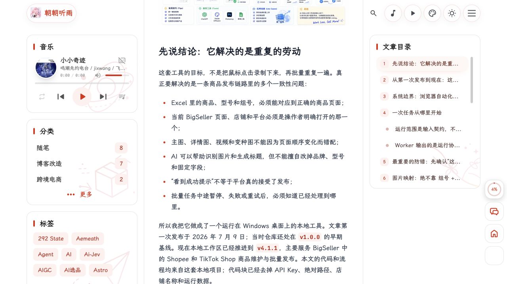
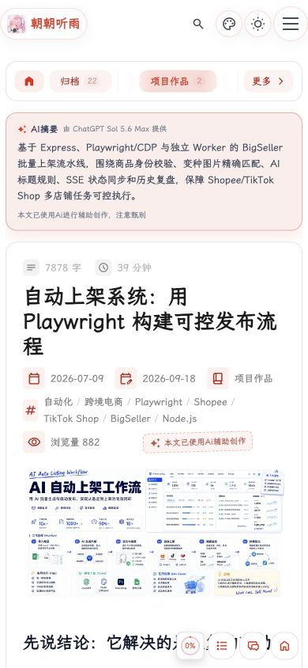
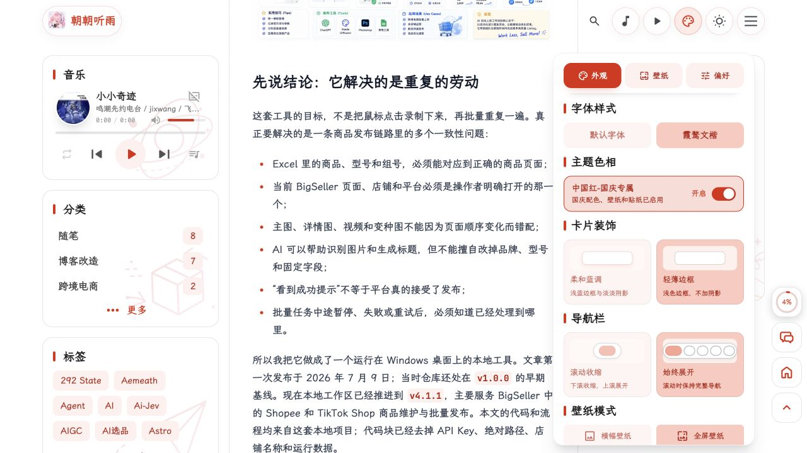
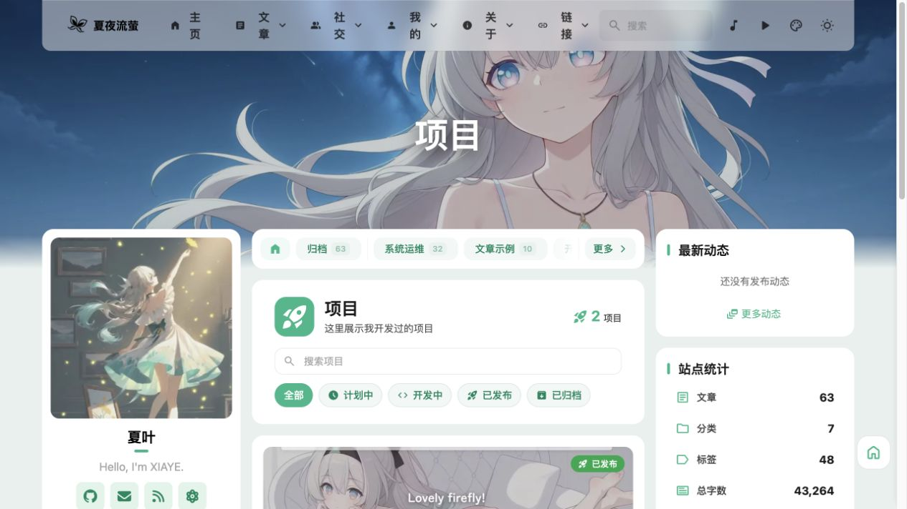
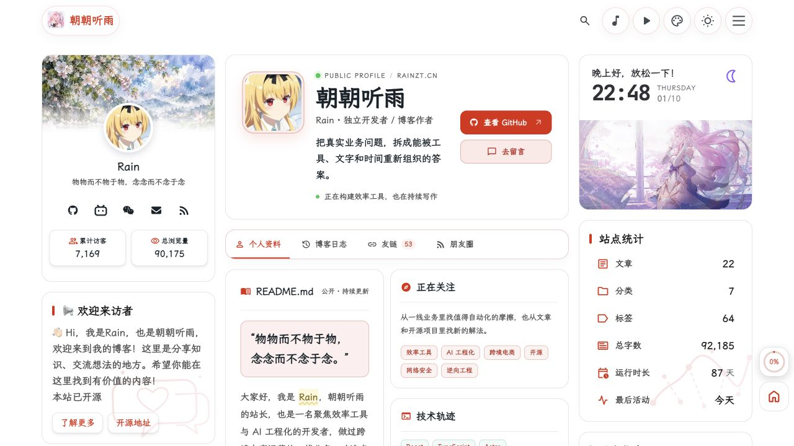
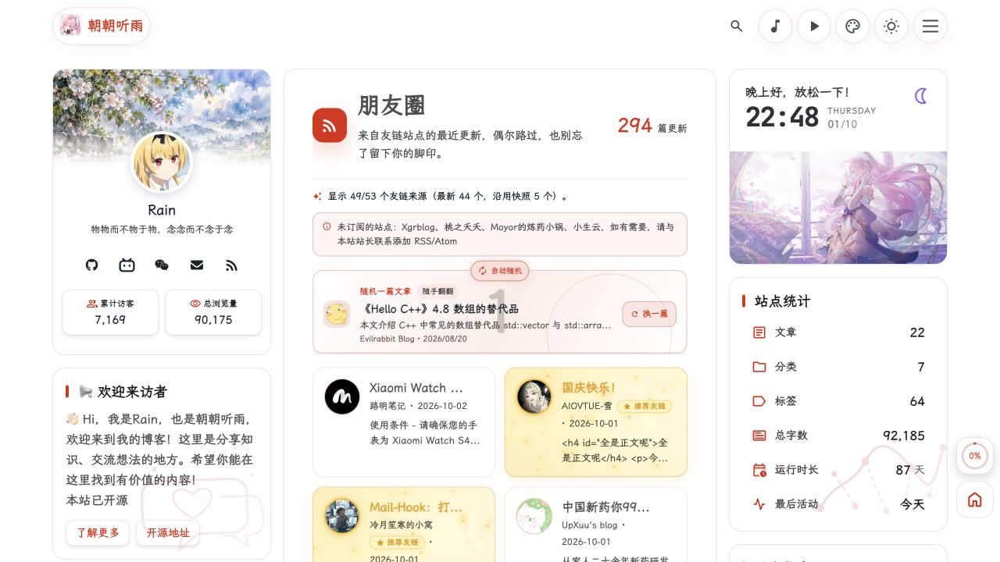

# Reference-site assessment and alignment proposal

Assessed on 2026-10-01, America/New_York. Scope: one owner project, Zhenkun-blog-site, informed by two references: [CuteLeaf](https://blog.cuteleaf.cn/) and [rainzt](https://rainzt.cn/). This is a live UX/design review plus a source-informed engineering proposal, not an implementation or deployment acceptance report.

Keep Firefly as the baseline. CuteLeaf is the better reference for article discovery and reusable blog capabilities; rainzt is useful for a stronger owner introduction, project presentation, and community discovery. Adopt selected patterns after the existing publication/path/interaction defects are repaired. Neither site's complete menu is a requirement for Zhenkun.

The target contracts are in [ARCHITECTURE](../../docs/ARCHITECTURE.md), the direction proposal is ADR-XB-006 in [DECISIONS](../../docs/DECISIONS.md), and the asset inventory/intake guide is [asset-brief](asset-brief.md). Only [ROADMAP](../../docs/ROADMAP.md) tracks task completion. Previous Zhenkun findings remain in the separate [audit report](../audit-2026-10-01/report.md) and [remediation plan](../audit-2026-10-01/remediation-plan.md).

## Evidence and limits

- Accepted screenshots were saved from live browser views and inspected from those saved bytes. Desktop captures use 1280 × 720; mobile captures measure 390 × 844. [observations.json](observations.json) records URL, title, viewport, headings, notes, and acceptance status. [keyboard-samples.json](keyboard-samples.json) records the sampled menu interaction.
- Claims are labeled OBSERVED for live behavior, SOURCE_CONFIRMED for inspected public code, INFERRED for an engineering/design judgment, and UNVERIFIED for a remaining gap. A public-code fact does not establish that the same code runs in production.
- The CuteLeaf site displays Firefly v6.16.8 / Astro v7.3.2; rainzt displays Aemeath V4.1.3 / Astro v7.0.2. These are displayed metadata, not independent deployment measurements. The inspected public Aemeath README describes V3.4.0. Its public snapshot excludes server-side comments, deployment operations, and secrets.
- Pinned source snapshots: [Firefly 6d82554b](https://github.com/CuteLeaf/Firefly/tree/6d82554bfe1cb3d4b43adb0969dad1d43ac6dee3), [Aemeath 376af918](https://github.com/Jarvis0227/Aemeath/tree/376af918eb2cd8a15c3acf1c993654700ae6ce82), both dated 2026-09-16. Current Zhenkun source was inspected on the existing cleanup branch at HEAD bc21bfd with uncommitted owner-data cleanup preserved.
- No login, comment submission, payment, user upload, geolocation permission, account setup, service deployment, or preference change was performed. Opening settings and temporary reading/navigation views did not authorize changing configuration.
- This review is not a full WCAG audit, Lighthouse/Core Web Vitals measurement, bandwidth benchmark, server security assessment, or exhaustive test of every optional page. Image/animation cost and contrast concerns below are design hypotheses unless backed by the stated interaction. Physical-device and screen-reader acceptance remain UNVERIFIED.
- Browser navigation worked even though a text-fetch tool timed out. Early Swup transitions and two incorrectly sized captures were rejected, retained as diagnostic files under the no-deletion instruction, and excluded from the accepted evidence below. rainzt/01-home.jpg includes a transient site welcome notice and is excluded from report publication; it is not evidence of the owner's location.

## Numbered review journey

Health labels summarize only the sampled task: Good, Needs attention, or Partly assessed. They are not numerical product scores or compliance certifications.

| Step | Task | CuteLeaf health | rainzt health |
|---|---|---|---|
| 1 | Arrive and identify the blog | Needs attention: crowded desktop navigation and failed background-video notice | Needs attention: memorable owner identity, but articles are below a full mobile screen |
| 2 | Discover and find an article | Needs attention: useful category/archive, first search fails then retry succeeds | Good for sampled search: first mobile query and result navigation work; archive filtering not tested |
| 3 | Read a long article | Good for sampled immersive reading; regular layout still allocates substantial space to sidebars | Good for sampled body/outline; desktop sidebar density competes with content |
| 4 | Open mobile navigation and use keyboard | Needs attention: focus escapes dialog; Escape then leaves it open | Needs attention: focus escapes dialog; Escape closes it without moving focus back to the trigger |
| 5 | Inspect appearance controls | Partly assessed: useful existing controls; persistence/reduced-motion behavior not tested | Partly assessed: richer controls; persistence/reduced-motion behavior not tested |
| 6 | Discover projects and community updates | Needs attention: usable project taxonomy but an example project is publicly listed | Needs attention: clear owner/projects structure and feed coverage, but some summaries expose raw HTML tags |

### 1. Arrival and identity

**Step 1 / CuteLeaf / Needs attention.** OBSERVED: recognizable illustrated banner, readable article cards, category strip, and useful metadata. At this viewport the crowded header wraps short navigation labels onto separate lines. The background area displays a video-load failure; an empty latest-dynamics widget occupies the right column. INFERRED: reduce initial choices and retain only content-bearing widgets for Zhenkun. Decorative illustration contrast and moving backgrounds need separate measured/manual acceptance; this capture does not establish a contrast failure.

**Step 1 / rainzt / Needs attention.** OBSERVED: owner name, short positioning, direct article/community links, and a strong illustrated composition. The October holiday palette is enabled in the inspected settings; it should not be treated as the site's permanent palette. INFERRED: identity is a useful pattern, while multiple stickers, animated layers, and a full-screen opening require a reader task to justify their cost. The review did not measure conversion or performance.

**Step 1 / CuteLeaf mobile.** OBSERVED: the first article begins within the sampled 844-pixel viewport; document width does not overflow. Background text/crops must be checked per owner material.

**Step 1 / rainzt mobile.** OBSERVED: the illustrated introduction fills the first screen; a down indicator points toward articles below. No document horizontal overflow was measured. INFERRED: Zhenkun should keep an explicit article entry and avoid requiring a long decorative opening on repeat visits. Skip/reduced-motion alternatives are not verified here.

### 2. Discovery, category filtering, and search

**Step 2 / CuteLeaf archive / Good.** OBSERVED: selecting the development-notes category changes the query URL, active category, count, and year-grouped list. Eight matching entries were displayed. Long row titles are truncated at this three-column width; the full destination still needs to remain discoverable. Borrow the content taxonomy and stable URLs before changing list cosmetics.

**Step 2 / CuteLeaf first search / Needs attention.** OBSERVED: a fresh About tab with query Wiki had a closed search panel and no displayed matches after initialization was given time. This is a failed first interaction, not evidence that matching articles do not exist.

**Step 2 / CuteLeaf search retry.** OBSERVED: clearing and retyping the same query opens two matching results. The paired captures support the symptom. Sharing a lineage with Zhenkun makes shared initialization logic a plausible cause, but exact live-version causation remains INFERRED. Zhenkun's independently recorded F02 should be fixed and accepted using actual production Pagefind output.

**Step 2 / rainzt search / Good.** OBSERVED: the first mobile query Playwright returns two matching links without retyping. Clicking the result within the search panel reaches the expected article; Step 3 includes the destination capture. This establishes the sampled query path, not exhaustive search correctness or desktop parity.

### 3. Long-form reading

**Step 3 / CuteLeaf standard reading.** OBSERVED: title, publication metadata, article content, and a right outline are available. The banner and sidebars use much of the initial viewport. The outline reduces navigation effort on a long technical post.

**Step 3 / CuteLeaf immersive reading / Good.** OBSERVED: entering immersive reading produces a cleaner dedicated reading surface with a left outline and hidden sidebars. Font-size, reading-width, and line-height controls were not verified. The active view exposes an exit affordance, while its button accessible name still describes entering; recheck state-dependent labeling before using the same pattern.

**Step 3 / rainzt desktop reading / Good with density concern.** OBSERVED: structured prose/lists and a persistent outline are readable. Both sidebars remain populated. INFERRED: keep the outline, give long-form content more space, and avoid adding calendar/music/time widgets merely to fill a column. The displayed progress control is a scrolling cue; it is not a measured amount of article understanding.

**Step 3 / rainzt mobile reading.** OBSERVED: search-result navigation lands on the expected title; body, cover, and metadata fit the viewport. An AI summary and several metadata rows precede the body. INFERRED: optional summaries can help scanning when authored/reviewed, but should not delay core prose or imply an unconfigured generation service. No summarization service was assessed.

### 4. Mobile navigation and keyboard boundaries

**Step 4 / CuteLeaf / Needs attention.** OBSERVED: after opening the dialog, one Tab moves focus to the hero GitHub link outside it. Escape from that outside link leaves the menu expanded. Escape from the menu trigger had closed it earlier, so failure is focus-context dependent. This is a focus-containment/close-path issue; it is not a claim that every Escape interaction fails.

**Step 4 / rainzt / Needs attention.** OBSERVED: one Tab after opening moves focus to a background lyrics control outside the dialog. Escape closes the drawer but focus remains on that outside control. Clear categories and owner links are useful visually; they do not establish accessible modal behavior. Both reference patterns need focus entry, containment, Escape from any current focus, focus return, and route-replacement cleanup. See the [keyboard sample](keyboard-samples.json).

### 5. Appearance controls

**Step 5 / CuteLeaf / Partly assessed.** OBSERVED: appearance/wallpaper/effects sections, hue, and card-style controls are exposed. Zhenkun already has most of this framework. INFERRED: choose owner defaults and labels before adding more switches. Reset behavior, keyboard sliders, preference migrations, and repeated-navigation cleanup were not exercised.

**Step 5 / rainzt / Partly assessed.** OBSERVED: font choices, holiday palette, card decoration, navigation scroll behavior, and wallpaper choices are presented with previews. INFERRED: visual previews clarify options, but new preference keys/events increase state and lifecycle obligations. Reuse existing Zhenkun controls first; do not copy the other author's role list, account settings, or browser-storage namespace.

### 6. Projects, personal context, and community

**Step 6 / CuteLeaf projects / Needs attention.** OBSERVED: project search, status filters, cards, details, and two entries exist; one is an example project dated 1970-01-01. A schema/template is useful engineering material, but a published example weakens owner-content credibility. SOURCE_CONFIRMED: the pinned newer Firefly includes a [project collection](https://github.com/CuteLeaf/Firefly/blob/6d82554bfe1cb3d4b43adb0969dad1d43ac6dee3/src/content.config.ts#L108) and [list route](https://github.com/CuteLeaf/Firefly/blob/6d82554bfe1cb3d4b43adb0969dad1d43ac6dee3/src/pages/projects/index.astro); the local Zhenkun baseline does not. Selective adaptation is a candidate, not permission to merge upstream. Its standard status keys are planning/developing/published/archived, but the schema permits other strings. The imported subset still needs explicit status/link contracts and base/guard/accessibility fixes.

**Step 6 / rainzt owner/projects / Good information structure.** OBSERVED through rendered page text: an owner introduction, personal project cards, source acknowledgement, interests, contact links, and a blog timeline. This screenshot shows the introduction; cards are further down. A separate independent portfolio route was not verified. SOURCE_CONFIRMED: the public V3.4.0 [About](https://github.com/Jarvis0227/Aemeath/blob/376af918eb2cd8a15c3acf1c993654700ae6ce82/src/pages/about.astro#L52) and [Tools](https://github.com/Jarvis0227/Aemeath/blob/376af918eb2cd8a15c3acf1c993654700ae6ce82/src/pages/tools.astro#L18) pages define project/tool arrays within large page files. Borrow the owner → interests → real work → contact sequence, using Zhenkun's own typed content and small components. Live panel data sources/refresh behavior were not independently verified. A future Zhenkun implementation must choose its own static snapshot or external integration explicitly; copying a panel does not establish its data or operating service.

**Step 6 / rainzt community feed / Needs attention.** OBSERVED: the page reports 49/53 participating sources, separates 44 latest sources and five reused snapshots, names unsubscribed sources, and offers random discovery plus paginated cards. Coverage/freshness visibility is a strong pattern. Some card summaries visibly contain escaped HTML tags; normalization needs improvement. Automatic random content also changes while the reader scans. SOURCE_CONFIRMED: the public V3.4.0 [feed implementation](https://github.com/Jarvis0227/Aemeath/blob/376af918eb2cd8a15c3acf1c993654700ae6ce82/src/utils/friends-feed.ts#L428) uses build-time RSS/Atom retrieval and cached snapshots. It is not a continuously refreshing service inherent in static hosting. A future Zhenkun collector should retain failure/staleness records and attribution, enforce bounded retrieval, and accept snapshots separately from page builds.

## Feature alignment matrix

Cost is a relative engineering judgment, not a time estimate. Local implementation references were inspected in this run. A disabled capability is available for later filling, not accepted for production merely because its template exists.

| Capability / reference evidence | Zhenkun baseline | Recommendation | Main boundary / cost |
|---|---|---|---|
| Articles, category/tag/archive, series — CuteLeaf OBSERVED | Existing routes, collections, content helpers | Reuse; fill owner content and repair publishing consistency | Local content; low adaptation cost |
| Search — both OBSERVED | Pagefind/Svelte search exists; F02 open | Repair first interaction before adopting more UI | Production index + cancellation + lifecycle; moderate |
| Outline and immersive reading — CuteLeaf OBSERVED | Existing TOC/immersive controls | Reuse and improve labels/focus after interaction fixes | Reading state and responsive acceptance; low/moderate |
| List/grid/masonry cards — SOURCE_CONFIRMED local | Existing siteConfig layout options | Select one reading-oriented default later | One visual variable; no new collection/service |
| Owner profile/About — rainzt OBSERVED | Own avatar/profile/About already exist | Refine content hierarchy; retain framework attribution | Owner-approved wording and real project evidence |
| Project collection/cards — CuteLeaf OBSERVED + SOURCE_CONFIRMED | No local project collection or dedicated routes | Optional selective upstream adaptation with typed owner records | Routes, capability guard, draft/slug/URL contracts; moderate |
| Tools/bookmarks — rainzt source + local source | Existing booknav template/config, disabled | Reuse booknav first; separate original tools from recommended links | Real owner data, link validation; low |
| Friends and guestbook — SOURCE_CONFIRMED local | Templates retained and off; own giscus already configured | Enable independently when there is owner content and accepted comment UX | giscus requires GitHub; anonymous alternatives add operating cost |
| Short dynamics — SOURCE_CONFIRMED local | Local Markdown/Memos adapter retained; off | Prefer local authored Markdown initially | Memos requires own endpoint, schema/HTML review; moderate |
| Friend RSS aggregation — rainzt OBSERVED + SOURCE_CONFIRMED | No equivalent local aggregator | Optional collector → accepted snapshot → static view | Network, freshness, failed coverage, scheduling; higher |
| Public gallery — SOURCE_CONFIRMED local | Scanner/routes/components retained; off | Enable only for a real approved public album | Public files; password does not protect image bytes |
| Wallpaper/font/hue/settings — both OBSERVED | Existing configurations/islands; five owner wallpapers available | Choose from existing assets; add preference previews only if useful | Crop, readability, storage/lifecycle; low/moderate |
| Open-screen scenes, stickers, animations — rainzt OBSERVED/source | Effects/Pio controls exist; advanced opening absent | Defer advanced opening and scroll choreography | Own art, base path, skip, reduced motion, measured cost; higher |
| Reading/scroll progress — rainzt OBSERVED/source | Existing floating navigation; optional isolated addition | Define progress semantics before adding | Document progress differs from article-body progress |
| Public analytics — rainzt OBSERVED/source | Do not reuse reference stats or account identifiers | Optional independent decision | Own provider/share settings, failure state, privacy and operating ownership |
| Commit activity/calendar — rainzt source | Article publication calendar exists; Git commit data source absent | Label actual metric honestly if adopted | Public API named pushes actually reads Git commit dates in inspected snapshot; local calendar uses article publication dates |
| Waline, server status, bills, donations, anime pages — partial/source | giscus configured/selected by ADR; current service behavior not revalidated; many optional pages disabled | Not baseline alignment goals | Own backend/accounts/business needs; no borrowed addresses/data |
| Local music/Lottie — source/visible controls | Local demo playlist/framework retained; effects off | Defer until owner purpose and asset permissions are clear | Audio/art permissions, no autoplay dependency for reading |

Implementation sources for optional patterns: [display settings](https://github.com/Jarvis0227/Aemeath/blob/376af918eb2cd8a15c3acf1c993654700ae6ce82/src/components/controls/DisplaySettingsIntegrated.svelte), [opening scene](https://github.com/Jarvis0227/Aemeath/blob/376af918eb2cd8a15c3acf1c993654700ae6ce82/src/components/features/HomePortfolioIntro.astro), [scroll progress](https://github.com/Jarvis0227/Aemeath/blob/376af918eb2cd8a15c3acf1c993654700ae6ce82/src/components/controls/ScrollProgress.astro), [comment choice](https://github.com/Jarvis0227/Aemeath/blob/376af918eb2cd8a15c3acf1c993654700ae6ce82/src/config/commentConfig.ts), [analytics choice](https://github.com/Jarvis0227/Aemeath/blob/376af918eb2cd8a15c3acf1c993654700ae6ce82/src/config/analyticsConfig.ts), and [Git-log-derived activity endpoint](https://github.com/Jarvis0227/Aemeath/blob/376af918eb2cd8a15c3acf1c993654700ae6ce82/src/pages/api/github-pushes.json.ts). These links pin public source behavior, not live V4.1.3 service operation. The local [Calendar](../../src/components/widget/Calendar.astro) uses article publication metadata.

## Highest-impact implementation sequence

This is dependency order and acceptance criteria, not a second live task board. Current task state remains in ROADMAP.

1. **Finish the already authorized owner-data cleanup.** Retain schemas/templates and MIT notices. Two original payment-code files remain public-copy candidates despite cleared references; cleanup is incomplete until their removal is authorized and verified. No deletion or build-cleanup exception was inferred from this comparison request.
2. **Repair deployment/publication contracts (F04–F07).** Distinguish logical routes, generated assets, and absolute protocol URLs. Check root and /Zhenkun-blog-site/ output, final media bytes, sitemap exclusion, real disabled-route behavior, and valid RSS dates. The current localized lastBuildDate is still a known issue; source-header cleanup did not fix it.
3. **Repair search and menu interaction (F02/F03).** Test the first query against generated Pagefind, stale requests, active/hidden inputs, focus entry/trap/return, Escape, route replacement, and repeated navigation. Reference-site bugs are reasons to verify inherited behavior, not targets to imitate.
4. **Consolidate shared capability/content policy incrementally.** A small metadata registry derives existing switches; navigation, route generation, sitemap, and APIs must agree. Extract publishing selection without redesigning every component. Disabled pages are not access control.
5. **Improve reading and identity with one visual decision at a time.** Select owner wallpaper, simplify nav/sidebar, refine typography/list layout, and keep a useful published-content empty state. Actual post publication still requires owner review. Preserve the user's deferred logo decision.
6. **Add optional content modules individually.** Projects/tools, then real friends/dynamics/gallery as needed. External RSS collection/analytics/comment replacement and advanced animation each need their own scoped proposal, operational ownership, and acceptance evidence.
7. **Align delivery verification.** A frozen dependency install, complete build, artifact checks, and authorized publication should use the same artifact. Assess advisory reachability before targeted compatible upgrades. A diagnostics pass is not a release or runtime pass.

## Boundaries and durable handoff

- Reuse the current Astro/Svelte/static deployment structure and existing folders. No new dependency, backend, top-level directory, Aemeath merge, bulk file move, or public service configuration is included in this assessment.
- Author accounts, contact/payment data, posts, friend lists, statistics, characters, and media are separate from reusable licensed framework code. Preserve license/provenance notices. Reference screenshots are evidence, not an asset license.
- Architecture proposals stay in ARCHITECTURE/DECISIONS; stable execution rules stay in PROCESS; actual errors go in ERROR_MEMORY; dated observations stay here. ROADMAP alone records the active packet, exclusions, verification, blockers, and next action. Git diff is implementation reality.
- Recover through AGENTS → ROADMAP → relevant ADR/error records → live Git. Recheck affected evidence after edits; do not turn old PASS into a current result. Report automated, browser, production, and deployed results separately.
- Raw new material can be dropped in ignored tmp/asset-intake/raw/; the [asset brief](asset-brief.md) specifies folders, public derivatives, and accompanying notes. Existing avatar/wallpapers need not be resupplied. Correctness repairs need no new images.

## Assessment delivery evidence

PASS: accepted live desktop/mobile captures; paired CuteLeaf search symptom; sampled keyboard focus behavior; rainzt search-result navigation; pinned public-source and local-boundary inspection; existing asset inventory and ignored intake boundary. [verification.json](verification.json) records capture hashes, document-link/whitespace checks, Git diff checks, and the source working-diff hash. These are assessment checks only.

FAIL: the observed reference first-search/menu/summary behaviors above. Zhenkun's own historical F02–F07 remain open; no fix is claimed by this report.

BLOCKED: production acceptance of the previous cleanup, because its two public payment-code files remain and the required build performs filesystem deletion prohibited by the current instructions.

NOT_APPLICABLE: application check/type-check/build for this documentation-only comparison increment. Historical checks are retained in the earlier remediation record and were not promoted to fresh source/runtime verification. Full WCAG, actual network/performance measurements, authenticated posting, payment, private-photo access control, and deployed feature acceptance remain UNVERIFIED.
