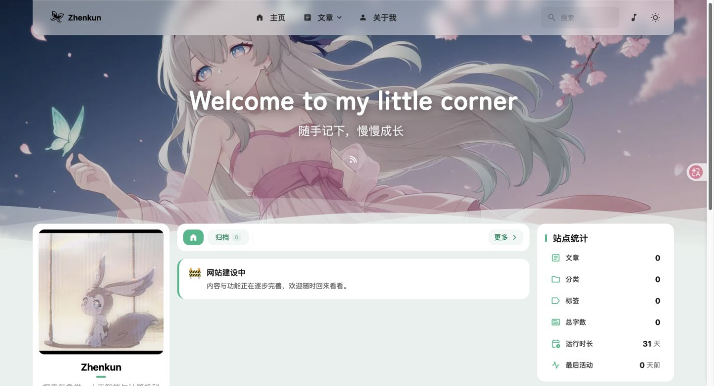

# 首页“网站建设中”本地候选 · 2026-10-05

**已完成本地实现与验证，未上线。** 源码提交 `c735ecdf8339e2342683ef74cc0b5c8458c1800c`，fresh远端main基线 `53cf67d121ce053b2d5f2aed4dd40c7d07d8506a`；分支 `codex/home-construction-notice`。

## 改动

首页分类导航下方显示“🚧 网站建设中”及“内容与功能正在逐步完善，欢迎随时回来看看。”。复用现有Announcement组件、公告配置、card-base和主题色；静态常规文档流，仅首个首页列表页显示，排除Pagefind。关闭侧栏/移动底部示例公告避免重复。四个源码文件，32行新增/5行删除；没有新依赖、框架或客户端监听。

## 证据

准确结果见[summary.json](summary.json)。Node24.20.0；主线已有依赖复制到隔离库，未取整改候选依赖、未安装。

- **PASS**：151/151 native、零skip；正式 `tsc --noEmit --isolatedDeclarations`；Astro257文件/0errors/0warnings/12原有hints；Biome298及四个改动文件单独check。
- **PASS**：`/`与`/Zhenkun-blog-site/`各正式八阶段完整构建/Pagefind、产物verifier；项目base HTTP核对首页文案各一条、About无提示、旧示例/草稿卡片无、搜索忽略属性存在。
- **PASS**：实际Edge production preview，桌面1462×792 DPR2、移动模拟390×844 DPR1，各明暗终态逐张查看。提示唯一、文字完整、无横向溢出、正常文档流、导航无覆盖；移动菜单Home→About→Home正常。
- **PASS**：原活动分支HEAD `b6c3e39`、main、tracked/index状态、`.workbuddy`、package/lock哈希前后相同。原仓库未修改。

[桌面亮色](desktop-light.jpg) · [桌面暗色](desktop-dark.jpg) · [移动亮色](mobile-light.jpg) · [移动暗色](mobile-dark.jpg) · [线上现状参考](live-reference-desktop.jpg)。线上参考为1462×839 DPR2，背景/打字机原有动态内容，不作像素对比。未保存或提交dev草稿截图。

## 假设与风险

pnpm11.22.0 wrapper自动依赖检查遇store SQLite权限失败，未重试安装；实际使用隔离副本内已有官方工具和tsx执行完整脚本顺序，不声称literal `pnpm build` 或frozen安装PASS。沙箱监听EPERM后只批准本地验证；Pagefind首次因PATH缺`.bin`失败，补本地executable PATH后通过。原始日志、argv和详细测量保留同目录，作为未跟踪本地诊断，不扩大最小交付提交；真实失败已追加ERROR_MEMORY。

Fresh主线无独立英文首页，新提示仅中文；继承的英文hero/其它文案未扩大修改，不接纳双语候选。未来在已接纳英文首页上另行使用“Under construction / Content and features are still being added.”。

整改库HEAD仍`563431d97338ee5c9e0e95784df869ae4d6f829c`，仅核对Git元数据：四个UI文件相对main无重叠变化。未导入其源码/证据/依赖，未测组合候选；其上传拒绝和未完成安全/Linux/GUI/合并状态仍由父任务处理。PR22观察为open/draft、head `d12dd98`，本轮未写入PR。物理手机、独立Chrome与远端CI未执行。

## 待授权动作

父任务独立审查/选择源码提交并协调后续整合，文档需语义合并，组合候选另测。本轮无push、merge、deploy、依赖/CI/安全门变更或文章公开；没有上线。浏览器视口/主题已恢复，临时标签及开发/预览server已关闭。
